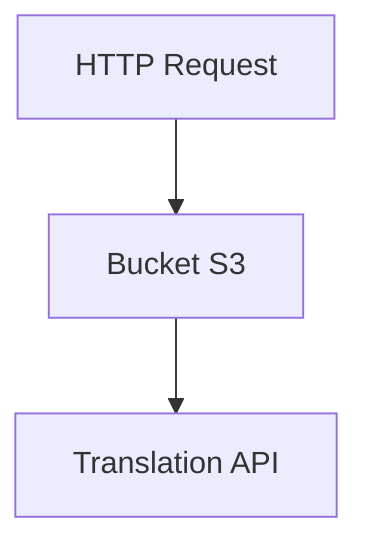
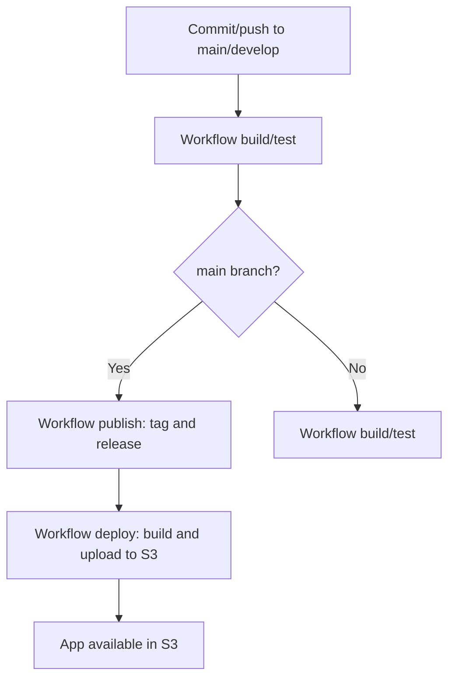

# tint-horror-app

[EN](README.md) | [ES](README_es.md)

[](https://github.com/antoniollv/tint-horror-app/actions/workflows/build.yml)


A React web application for displaying comic strips.

Proof of concept for CI/CD processes.

## Table of Contents

- [Description](#description)
- [Structure](#structure)
- [App Features](#app-features)
- [Project Structure](#project-structure)
- [App Diagram](#app-diagram)
- [CI/CD Flow](#cicd-flow)
- [Local Requirements](#local-requirements)
- [Local Installation](#local-installation)
- [Deployment](#deployment)
  - [Infrastructure](#infrastructure)
- [Environment Variables](#environment-variables)
- [AWS Roles and Policies](#aws-roles-and-policies)
- [GitHub Secrets](#github-secrets)
  - [Configuration](#configuration)
  - [Commit Conventions](#commit-conventions)
- [Project Status](#project-status)
  - [Working Features](#working-features)
  - [Pending or To Review](#pending-or-to-review)
- [License](#license)
- [Contributions](#contributions)

## Description

The app loads a YAML configuration file and displays images as comic panels with speech bubbles. If a translation API is available, text is translated according to the browser language.

The goal is to provide a _fun_ app for end-to-end CI/CD proof-of-concept testing.

Version v1 deploys the app to an AWS S3 bucket. The CI/CD process is described in [README_devops](./README_devops.md).

## Structure

- React App: [tint-strips/](tint-strips)
- Infrastructure as code: [infra/](infra)
- CI/CD Workflows:
  - [00-prerequisites.yml](.github/workflows/00-prerequisites.yml)
  - [01-infra-deploy.yml](.github/workflows/01-infra-deploy.yml)
  - [02-app-deploy.yml](.github/workflows/02-app-deploy.yml)
  - [publish.yml](.github/workflows/publish.yml)
  - [build.yml](.github/workflows/build.yml)
- Automatic versioning config: [.releaserc.json](.releaserc.json)
- Changelog: [CHANGELOG.md](CHANGELOG.md)
- Licenses: [LICENSE](LICENSE), [LICENSE-IMAGES](LICENSE-IMAGES)
- CI/CD documentation: [README_devops.md](README_devops.md)
- Utility script for uploading directory contents to AWS S3: [upload_to_s3.sh](upload_to_s3.sh)

## App Features

- Interactive comic strip viewer with navigation.
- Chapter selection and animated panels.
- Multilanguage support via translation API.
- Dynamic resource loading and device optimization.

## Project Structure

```text
tint-horror-app/
├── infra/                # Infrastructure as code (Terraform, AWS policies)
├── tint-strips/          # Web app source code
│   ├── src/              # React components, hooks, utilities
│   ├── public/           # Public assets (images, manifests)
│   └── build/            # Production build output
└── .github/workflows/    # CI/CD workflows (GitHub Actions)
```

## App Diagram



## CI/CD Flow

Continuous integration and deployment is automated with GitHub Actions and AWS S3. The process is as follows:



## Local Requirements

- Node.js 22+
- npm 9+

## Local Installation

1. Clone the repository

   ```bash
   git clone https://github.com/youruser/tint-horror-app.git
   ```

2. Install dependencies

   ```bash
   cd tint-strips
   npm install
   ```

## Deployment

Deployment is managed via GitHub Actions and AWS S3. Environments: `dev` and `prod`.

### Infrastructure

Infrastructure is managed with Terraform (S3 buckets, IAM policies, OIDC roles, SSM parameters).

1. Configure AWS secrets in GitHub (see [GitHub Secrets](#github-secrets)).
2. Run the prerequisites workflow to create base resources.
3. Run the deploy workflow to upload the app to S3.

> NOTE: A release TAG is required. Tags are created automatically when changes are pushed to the `main` branch with at least one commit following _Conventional Commits_.

## Environment Variables

Environment variables are defined in `.env.environment` files in `tint-strips/` and as secrets in GitHub:

```env
VITE_IMAGE_PATH=/imgs/
VITE_YAML_CONFIG_PATH=/comics.yml
VITE_TRANSLATION_API_URL=http://localhost:5000/translate
#VITE_TRANSLATION_API_KEY="SET IN GITHUB SECRETS"
```

Critical variables such as AWS keys and API keys must be set as GitHub secrets (Settings > Environments).

## AWS Roles and Policies

Roles and policies are used to allow GitHub Actions workflows to operate on AWS resources:

- **OIDC Role**: Allows GitHub Actions to assume a role in AWS via OIDC, restricted to the configured repo and environment.
- **IAM Policy**: Allows creation, modification, and deletion of S3 buckets, management of SSM parameters, and operation on the Terraform backend.

Policy templates:

- [infra/policies/iam-policy.json.tpl](infra/policies/iam-policy.json.tpl)
- [infra/policies/trust-policy.json.tpl](infra/policies/trust-policy.json.tpl)

Variables and resources are parameterized per environment (`dev`/`prod`).

## GitHub Secrets

Only for bootstrap, prerequisites workflow:

- `AWS_ACCESS_KEY_ID`
- `AWS_SECRET_ACCESS_KEY`

Required secrets for GitHub environments:

- `TRANSLATION_API_KEY`: If using a translation API and required
- `AWS_REGION`: AWS region for infrastructure, app, and resources. Not critical, but limit exposed information.

Secrets are defined in the corresponding environment (`dev` or `prod`) in GitHub > Settings > Environments.

### Configuration

- `semantic-release` config: [.releaserc.json](.releaserc.json)
- Environment config: [infra/prerequsites.json](infra/prerequsites.json)
  Configuration is stored as parameters in AWS Service Manager during the prerequisites workflow

  - app_bucket_name: S3 bucket name for the app  
  - iam_role_name: AWS role for OIDC
  - iam_policy_name: IAM policy assigned to the role
  - tf_state_bucket: S3 bucket for Terraform state file (also used for comic images)
  - tf_state_key: Path and file for Terraform state in the S3 bucket
  - images_folder: Path to images in the Terraform S3 bucket

### Commit Conventions

Commit type determines the published version:

- `feat:` → **minor**
- `fix:` → **patch**
- `perf:` → **patch**
- `refactor:` → **patch** (if behavior changes)
- `docs:`, `chore:`, `test:`, `build:`, `ci:` → **no release**

For **major**, add `BREAKING CHANGE:` in the commit body.

Valid examples:

- `feat: add chapter selector`
- `fix: fix comics.yml loading`
- `refactor: simplify strip loading`

> Note: For breaking changes, write `BREAKING CHANGE:` in the commit body.

---

## Project Status

Brief summary of code status and review points.

### Working Features

- Functional React app with comic navigation.
- Dynamic speech bubbles and automatic translation.
- YAML configuration loading.
- Deployment to AWS S3.

### Pending or To Review

- Containerized deployment
- Translation API must be available externally.
- Only build test is defined (`Test Build`).

---

## License

This project is open source under:

- Code: MIT. See [LICENSE](LICENSE).
- Images: Creative Commons Attribution 4.0 (CC BY 4.0). See [LICENSE-IMAGES](LICENSE-IMAGES).

---

## Contributions

Contributions are welcome!

If you want to improve this project, fix bugs, or propose new features, open an issue or submit a pull request.

Please follow these steps:

1. Fork the repository.
2. Create a new branch for your changes.
3. Make your changes and commit.
4. Open a pull request describing your contribution.
