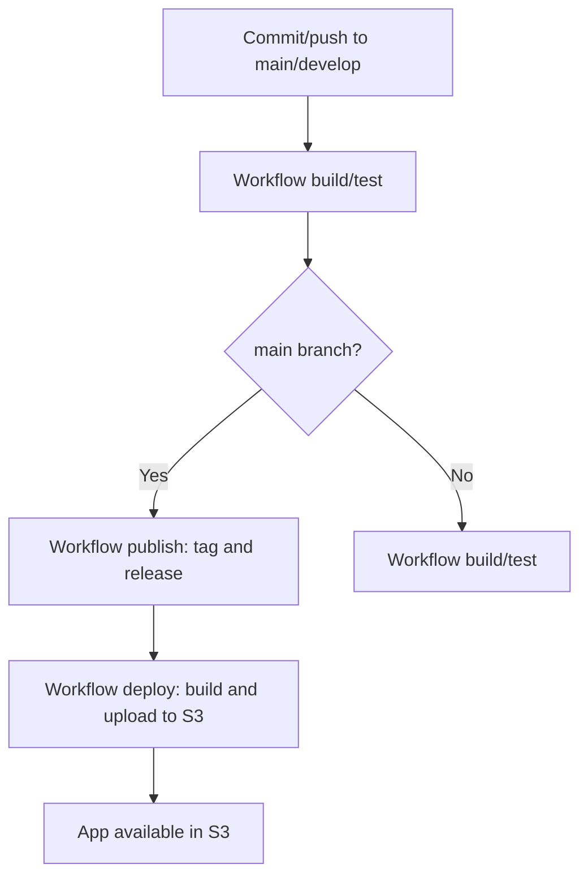

# DevOps CI/CD Guide

[EN](README_devops.md) | [ES](README_devops_es.md)

CI/CD deployment process for the `tint-horror-app` application.

## Table of Contents

- [CI/CD Flow](#cicd-flow)
- [Getting Started](#getting-started)
- [Environment Configuration](#environment-configuration)
- [AWS Roles and Policies](#aws-roles-and-policies)
- [GitHub Secrets](#github-secrets)
- [Workflows](#workflows)
- [Paths and Assets](#paths-and-assets)
- [Rollback](#rollback)
- [Security and Notes](#security-and-notes)
- [Infrastructure Cleanup](#infrastructure-cleanup)

## CI/CD Flow



## Getting Started

1. Fill in the environment configuration in [infra/prerequsites.json](infra/prerequsites.json).
2. Run the prerequisites workflow (`00. Setup AWS Prerequisites`) to create the Terraform backend and OIDC role.
3. Run the infrastructure workflow (`01. Deploy Infrastructure - Bucket & SSM Parameters`) to create the hosting bucket.
4. The publish workflow (`Publish`) runs automatically when new code reaches the `main` branch, generating a release TAG.
5. Run the deploy workflow (`02. Deploy App to S3`) to build and upload the app to the bucket.

## Environment Configuration

In [infra/prerequsites.json](infra/prerequsites.json), define per environment:

- `app_bucket_name`: Unique hosting bucket name.
- `aws_account_id`: 12-digit AWS account ID.
- `aws_region`: Region for resource creation.
- `github_org`: GitHub organization/owner (for OIDC policy).
- `github_repo`: Repo name (for OIDC policy and SSM prefix).
- `iam_role_name` and `iam_policy_name`: OIDC role and policy names (include environment).
- `infra_tf_state_key`: State path for hosting bucket.
- `tf_state_bucket`: Terraform state bucket (with versioning, encryption, and public access block).
- `tf_state_key`: Main state path (include environment).

You must also create the GitHub Environment (`dev` or `prod`) and add bootstrap secrets:

- `AWS_ACCESS_KEY_ID`
- `AWS_SECRET_ACCESS_KEY`

These secrets are only used in the `00. Setup AWS Prerequisites` workflow.

## AWS Roles and Policies

Roles and policies allow GitHub Actions workflows to operate on AWS resources:

- **OIDC Role**: Allows GitHub Actions to assume a role in AWS via OIDC, limited to the configured repo and environment.
- **IAM Policy**: Allows creation, modification, and deletion of S3 buckets, management of SSM parameters, and operation on the Terraform backend.

Policy templates:

- [infra/policies/iam-policy.json.tpl](infra/policies/iam-policy.json.tpl)
- [infra/policies/trust-policy.json.tpl](infra/policies/trust-policy.json.tpl)

Variables and resources are parameterized per environment (`dev`/`prod`).

### Creating IAM Bootstrap User in AWS Console

The bootstrap policy should allow general resources. It is recommended to delete or deactivate the key after the workflow completes.

Steps:

1. Log in with the root account and go to IAM.
2. Create an IAM user (e.g., `bootstrap-devops`).
3. In **Create access key**, choose **CLI**.
4. Assign permissions as below.
5. Create the access key and copy `AWS_ACCESS_KEY_ID` and `AWS_SECRET_ACCESS_KEY` for the GitHub Environment.

Required permissions for the `00. Setup AWS Prerequisites` workflow:

- S3: create bucket, enable versioning, encryption, and public access block.
- IAM: create/update OIDC provider, role, and policy.
- SSM: create/update parameters under `/repo/env/prerequisites`.

Permission options:

- Simple: Attach `AdministratorAccess` to the bootstrap user and remove it after completion.
- Custom: Custom policy with specific actions (avoid `iam:*`).

Example custom policy:

```json
{
   "Version": "2012-10-17",
   "Statement": [
      {
         "Sid": "S3StateBucketBootstrap",
         "Effect": "Allow",
         "Action": [
            "s3:CreateBucket",
            "s3:ListBucket",
            "s3:GetBucketLocation",
            "s3:PutBucketVersioning",
            "s3:PutEncryptionConfiguration",
            "s3:PutBucketPublicAccessBlock"
         ],
         "Resource": "*"
      },
      {
         "Sid": "IAMBootstrap",
         "Effect": "Allow",
         "Action": [
            "iam:CreateOpenIDConnectProvider",
            "iam:ListOpenIDConnectProviders",
            "iam:GetOpenIDConnectProvider",
            "iam:UpdateOpenIDConnectProviderThumbprint",
            "iam:CreateRole",
            "iam:UpdateAssumeRolePolicy",
            "iam:GetRole",
            "iam:CreatePolicy",
            "iam:ListPolicies",
            "iam:GetPolicy",
            "iam:CreatePolicyVersion",
            "iam:ListPolicyVersions",
            "iam:DeletePolicyVersion",
            "iam:AttachRolePolicy"
         ],
         "Resource": "*"
      },
      {
         "Sid": "SSMPrerequisitesWrite",
         "Effect": "Allow",
         "Action": [
            "ssm:PutParameter",
            "ssm:GetParameter",
            "ssm:GetParameters"
         ],
         "Resource": "*"
      },
      {
         "Sid": "STSIdentity",
         "Effect": "Allow",
         "Action": "sts:GetCallerIdentity",
         "Resource": "*"
      }
   ]
}
```

## GitHub Secrets

Required secrets for GitHub environments:

- `AWS_ACCESS_KEY_ID` and `AWS_SECRET_ACCESS_KEY` (bootstrap only, prerequisites)
- `TRANSLATION_API_KEY` (if using external translation API)
- `GITHUB_TOKEN` (provided automatically by GitHub Actions)
- `AWS_REGION` (not critical, but limit exposed information)

Secrets are defined in the corresponding environment (`dev` or `prod`) in GitHub > Settings > Environments.

## Workflows

### Workflow Inputs

Inputs:

- `environment`: Selects the GitHub Environment (`dev` or `prod`). Used to read the correct block from [infra/prerequsites.json](infra/prerequsites.json) and to load/save parameters in SSM under the corresponding prefix.

Inputs per workflow:

- `prerequisites` / `environment`: creates the Terraform backend and OIDC role for that environment.
- `infra-deploy` / `environment`: deploys the hosting bucket in that environment.
- `infra-deploy` / `action`: `apply` creates/updates resources, `destroy` removes them.
- `app-deploy` / `environment`: deploys to the environment's bucket.
- `app-deploy` / `tag`: if specified, deploys that tag; otherwise, uses the latest `v*`.

#### 00. Setup AWS Prerequisites

Workflow: [.github/workflows/00-prerequisites.yml](.github/workflows/00-prerequisites.yml)

Runner requirements:

- `envsubst` must be available (part of `gettext-base`). Add this step if needed:

  ```yaml
  - name: Install envsubst
    run: |
      set -euo pipefail
      sudo apt-get update
      sudo apt-get install -y gettext-base
  ```

What it does:

- Reads [infra/prerequsites.json](infra/prerequsites.json) for the environment.
- Creates the S3 backend bucket (versioning, encryption, public access block).
- Creates OIDC provider if not present.
- Creates or updates IAM role and policy.
- Stores data in SSM under `/repo/env/prerequisites`.
- Creates folder for comic panel images persistence.

SSM parameters stored:

- `aws_region`
- `aws_account_id`
- `tf_state_bucket`
- `tf_state_key`
- `aws_role_arn`

If bootstrap secrets are missing, the workflow fails with a clear message.

To avoid including all comic images in the repository (due to size), images are uploaded to the AWS S3 bucket used for Terraform support. After app deployment, images are synchronized to the app bucket.

Example script to upload a local directory to AWS S3 bucket:

```bash
if [ "$#" -ne 3 ]; then
  echo "Usage: $0 <local_directory> <bucket> <s3_path>"
  exit 1
fi
LOCAL_DIR="$1"
BUCKET="$2"
S3_PATH="$3"
if [ ! -d "$LOCAL_DIR" ]; then
  echo "Directory $LOCAL_DIR does not exist."
  exit 2
fi
echo "Uploading $LOCAL_DIR to s3://$BUCKET/$S3_PATH ..."
aws s3 sync "$LOCAL_DIR" "s3://$BUCKET/$S3_PATH" --delete
echo "Upload completed."
```

#### 01. Deploy Infrastructure - Bucket & SSM Parameters

Workflow: [01-infra-deploy.yml](.github/workflows/01-infra-deploy.yml)

What it does:

- Uses OIDC (no AWS keys).
- Reads backend from SSM and key from JSON.
- Applies Terraform in [infra/terraform/app-bucket](infra/terraform/app-bucket).
- Stores bucket data in SSM under `/repo/env/app`.

SSM parameters stored:

- `bucket_name`
- `website_endpoint`
- `website_domain`

#### Publish (TAGs)

Workflow: [publish.yml](.github/workflows/publish.yml)

What it does:

- Creates release tags with _semantic-release_.
- Does not generate artifacts or deploy.

#### 02. Deploy App to S3

Workflow: [02-app-deploy.yml](.github/workflows/02-app-deploy.yml)

What it does:

- Uses OIDC (no AWS keys).
- Builds from the latest tag `v*`, or a specific one if indicated.
- Build in [tint-strips](tint-strips), output in [tint-strips/build](tint-strips/build).
- Deploys to S3 with `aws s3 sync`.
- If bucket not found in SSM, uses `app_bucket_name` from JSON.
- Synchronizes images between buckets.

## Paths and Assets

Images and assets are sourced from [tint-strips/public](tint-strips/public) and served from the hosting bucket.
Build output is generated in [tint-strips/build](tint-strips/build). Vite base is `./`, so paths are relative.

## Recommended Execution Order

1. Run [00-prerequisites.yml](.github/workflows/00-prerequisites.yml) for the environment.
2. Run [01-infra-deploy.yml](.github/workflows/01-infra-deploy.yml) with `action=apply`.
3. Push changes to `main` following _semantic-release_ to run [publish.yml](.github/workflows/publish.yml) and generate a TAG.
4. Run [02-app-deploy.yml](.github/workflows/02-app-deploy.yml) to upload the app to S3.

## Rollback

To revert to a previous version:

- Run the `app-deploy` workflow specifying an earlier tag.

## Security and Notes

- OIDC restricts access to the configured repo.
- Secrets are not published in summaries or artifacts.
- SSM centralizes deployment parameters.

Permission options:

- Simple: Attach `AdministratorAccess` to the bootstrap user and remove it after completion.
- Custom (general resources): Custom policy with specific actions. Avoid `iam:*` as the console blocks `iam:PassRole` and `iam:CreateServiceLinkedRole` with `Resource: "*"`.

Example custom policy (general scope, no bucket names):

```json
{
   "Version": "2012-10-17",
   "Statement": [
      {
         "Sid": "S3StateBucketBootstrap",
         "Effect": "Allow",
         "Action": [
            "s3:CreateBucket",
            "s3:ListBucket",
            "s3:GetBucketLocation",
            "s3:PutBucketVersioning",
            "s3:PutEncryptionConfiguration",
            "s3:PutBucketPublicAccessBlock"
         ],
         "Resource": "*"
      },
      {
         "Sid": "IAMBootstrap",
         "Effect": "Allow",
         "Action": [
            "iam:CreateOpenIDConnectProvider",
            "iam:ListOpenIDConnectProviders",
            "iam:GetOpenIDConnectProvider",
            "iam:UpdateOpenIDConnectProviderThumbprint",
            "iam:CreateRole",
            "iam:UpdateAssumeRolePolicy",
            "iam:GetRole",
            "iam:CreatePolicy",
            "iam:ListPolicies",
            "iam:GetPolicy",
            "iam:CreatePolicyVersion",
            "iam:ListPolicyVersions",
            "iam:DeletePolicyVersion",
            "iam:AttachRolePolicy"
         ],
         "Resource": "*"
      },
      {
         "Sid": "SSMPrerequisitesWrite",
         "Effect": "Allow",
         "Action": [
            "ssm:PutParameter",
            "ssm:GetParameter",
            "ssm:GetParameters"
         ],
         "Resource": "*"
      },
      {
         "Sid": "STSIdentity",
         "Effect": "Allow",
         "Action": "sts:GetCallerIdentity",
         "Resource": "*"
      }
   ]
}
```

## Infrastructure Cleanup

To remove all resources created by the workflows, follow these two steps:

### 1. Remove infrastructure with Terraform

Run the `[01-infra-deploy.yml](.github/workflows/01-infra-deploy.yml)` workflow, select the environment (`environment`), and choose `destroy` for the `action` input. This will run `terraform destroy` and remove the hosting bucket and SSM parameters associated with the app.

### 2. Manually remove prerequisites resources

The prerequisites workflow (`[00-prerequisites.yml](.github/workflows/00-prerequisites.yml)`) creates the Terraform backend bucket, IAM OIDC role, IAM policy, and SSM parameters under `/repo/env/prerequisites`. These resources must be deleted manually:

- **S3**: Delete the Terraform backend bucket (`tf_state_bucket`).
- **IAM**: Delete the IAM role (`iam_role_name`) and IAM policy (`iam_policy_name`).
- **SSM**: Delete parameters under the prefix `/repo/env/prerequisites` in AWS Systems Manager Parameter Store.
- **OIDC**: If not used by other repositories, delete the OIDC provider (`token.actions.githubusercontent.com`) in the IAM console.

Check the exact names in your `infra/prerequsites.json` file for each environment.

## Repository Structure

```text
/
├── CHANGELOG.md
├── cloudFrom.md
├── LICENSE
├── LICENSE-IMAGES
├── notas.md
├── README_devops_es.md
├── README_es.md
├── README.md
├── infra/
│   ├── prerequsites.json
│   ├── policies/
│   │   ├── iam-policy.json.tpl
│   │   └── trust-policy.json.tpl
│   └── templates/
│   └── terraform/
│       └── app-bucket/
│           ├── main.tf
│           ├── outputs.tf
│           └── variables.tf
└── tint-strips/ (React App)  
```
