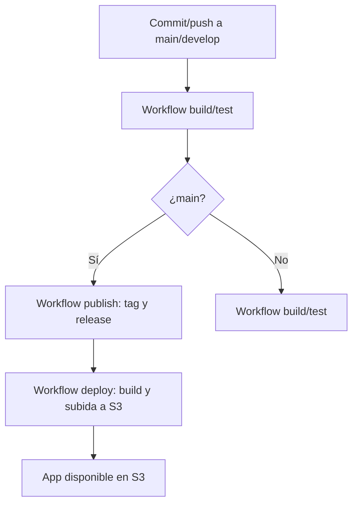

# Guía DevOps CI/CD

[EN](README_devops.md) | [ES](README_devops_es.md)

Proceso CI/CD de despliegue de la aplicación `tint-horror-app`.

## Tabla de Contenidos

- [Flujo CI/CD](#flujo-cicd)
- [Por dónde empezar](#por-dónde-empezar)
- [Configuración por entorno](#configuración-por-entorno)
- [Roles y policies AWS](#roles-y-policies-aws)
- [Secretos de GitHub](#secretos-de-github)
- [Workflows](#workflows)
- [Rutas y assets](#rutas-y-assets)
- [Rollback](#rollback)
- [Seguridad y notas](#seguridad-y-notas)
- [Limpieza de la infraestructura](#limpieza-de-la-infraestructura)

## Flujo CI/CD



## Por dónde empezar

1. Rellena la configuración por entorno en [infra/prerequsites.json](infra/prerequsites.json).
2. Ejecuta el workflow de pre-requisitos (`00. Setup AWS Prerequisites`) para crear el backend de Terraform y el rol OIDC.
3. Ejecuta el workflow de infraestructura (`01. Deploy Infrastructure - Bucket & SSM Parameters`) para crear el bucket de hosting.
4. El workflow publish (`Publish`) se ejecuta automáticamente cuando llega codigo nuevo a rama `main`, generar TAG de release.
5. Ejecuta el workflow de deploy (`02. Deploy App to S3`) para construir y subir la app al bucket.

## Configuración por entorno

En [infra/prerequsites.json](infra/prerequsites.json) define, por entorno:

- `app_bucket_name`: nombre único del bucket de hosting.
- `aws_account_id`: ID numérico de 12 dígitos de tu cuenta AWS.
- `aws_region`: región donde se crean los recursos.
- `github_org`: organización/owner del repo (para policy OIDC).
- `github_repo`: nombre del repo (para policy OIDC y prefijo SSM).
- `iam_role_name` y `iam_policy_name`: nombre del rol y policy OIDC (incluye entorno).
- `infra_tf_state_key`: ruta del state del bucket de hosting.
- `tf_state_bucket`: bucket del state de Terraform (con versioning, encryption y public access block).
- `tf_state_key`: ruta principal del state (incluye entorno).

También debes crear el GitHub Environment (`dev` o `prod`) y añadir los secretos de bootstrap:

- `AWS_ACCESS_KEY_ID`
- `AWS_SECRET_ACCESS_KEY`

Estos secretos solo se usan en el workflow `00. Setup AWS Prerequisites`

## Roles y policies AWS

Se utilizan roles y policies para permitir a los workflows de GitHub Actions operar sobre los recursos de AWS:

- **Rol OIDC**: Permite a GitHub Actions asumir un rol en AWS mediante OIDC, limitado al repo y entorno configurado.
- **Policy IAM**: Permite crear, modificar y eliminar buckets S3, gestionar parámetros en SSM y operar sobre el backend de Terraform.

Los templates de policies se encuentran en:

- [infra/policies/iam-policy.json.tpl](infra/policies/iam-policy.json.tpl)
- [infra/policies/trust-policy.json.tpl](infra/policies/trust-policy.json.tpl)

Variables y recursos se parametrizan por entorno (`dev`/`prod`).

### Creación de usuario IAM bootstrap en consola AWS

La policy de bootstrap debe permitir recursos generales. Se recomienda eliminar o desactivar la clave cuando termine el workflow.

Pasos:

1. Inicia sesión con la cuenta root y entra en IAM.
2. Crea un usuario IAM (por ejemplo `bootstrap-devops`).
3. En **Create access key**, elige **Interfaz de línea de comandos (CLI)**.
4. Asigna permisos, a continuación.
5. Crea el access key y copia `AWS_ACCESS_KEY_ID` y `AWS_SECRET_ACCESS_KEY` para el GitHub Environment.

Permisos requeridos por el workflow `00. Setup AWS Prerequisites`

- S3: crear bucket, habilitar versioning, encryption y public access block.
- IAM: crear/actualizar el proveedor OIDC, rol y policy.
- SSM: crear/actualizar parámetros bajo `/repo/env/prerequisites`.

Opciones de permisos:

- Opción simple: adjuntar `AdministratorAccess` al usuario bootstrap y retirarla al terminar.
- Opción custom: policy propia con acciones específicas (evita `iam:*`).

Ejemplo de policy custom:

```json
{
   "Version": "2012-10-17",
   "Statement": [
      {
         "Sid": "S3StateBucketBootstrap",
         "Effect": "Allow",
         "Action": [
            "s3:CreateBucket",
            "s3:ListBucket",
            "s3:GetBucketLocation",
            "s3:PutBucketVersioning",
            "s3:PutEncryptionConfiguration",
            "s3:PutBucketPublicAccessBlock"
         ],
         "Resource": "*"
      },
      {
         "Sid": "IAMBootstrap",
         "Effect": "Allow",
         "Action": [
            "iam:CreateOpenIDConnectProvider",
            "iam:ListOpenIDConnectProviders",
            "iam:GetOpenIDConnectProvider",
            "iam:UpdateOpenIDConnectProviderThumbprint",
            "iam:CreateRole",
            "iam:UpdateAssumeRolePolicy",
            "iam:GetRole",
            "iam:CreatePolicy",
            "iam:ListPolicies",
            "iam:GetPolicy",
            "iam:CreatePolicyVersion",
            "iam:ListPolicyVersions",
            "iam:DeletePolicyVersion",
            "iam:AttachRolePolicy"
         ],
         "Resource": "*"
      },
      {
         "Sid": "SSMPrerequisitesWrite",
         "Effect": "Allow",
         "Action": [
            "ssm:PutParameter",
            "ssm:GetParameter",
            "ssm:GetParameters"
         ],
         "Resource": "*"
      },
      {
         "Sid": "STSIdentity",
         "Effect": "Allow",
         "Action": "sts:GetCallerIdentity",
         "Resource": "*"
      }
   ]
}
```

## Secretos de GitHub

Los secretos requeridos en los entornos de GitHub son:

- `AWS_ACCESS_KEY_ID` y `AWS_SECRET_ACCESS_KEY` (solo para bootstrap, en pre-requisitos)
- `TRANSLATION_API_KEY` (si se usa API de traducción externa)
- `GITHUB_TOKEN` (proporcionado automáticamente por GitHub Actions)
- `AWS_REGION` No es critico, pero cuanta menos información se ofrezca mejor

Los secretos se definen en el entorno correspondiente (`dev` o `prod`) en GitHub > Settings > Environments.

## Workflows

### Inputs de workflows

Inputs:

- `environment`: selecciona el GitHub Environment (`dev` o `prod`). Se usa para leer el bloque correcto de [infra/prerequsites.json](infra/prerequsites.json) y para cargar/guardar parámetros en SSM bajo el prefijo correspondiente.

Inputs por workflow:

| `00. Setup AWS Prerequisites` | Descripción |
| ----------------------------- | ----------- |
| **environment** | Crea el backend de Terraform y el rol OIDC para ese entorno. |

| `01. Deploy Infrastructure - Bucket & SSM Parameters` | Descripción |
| ----------------------------------------------------- | ----------- |
| **environment** | Despliega el bucket de hosting en ese entorno. |
| **action** | `apply` crea/actualiza recursos, `destroy` los elimina, con **Terraform**. |

| `02. Deploy App to S3` | Descripción |
| ---------------------- | ----------- |
| **environment** | Despliega al bucket de ese entorno. |
| **tag** | Obcional, si se indica, despliega ese TAG; si no, usa el último generado `v*`. |

#### 00. Setup AWS Prerequisites

Workflow: [.github/workflows/00-prerequisites.yml](.github/workflows/00-prerequisites.yml)

Requisitos del runner:

- `envsubst` disponible en el runner (parte de `gettext-base`).
  Añadir este step si no se incluye en el runner:

  ```yaml
  - name: Install envsubst
    run: |
      set -euo pipefail
      sudo apt-get update
      sudo apt-get install -y gettext-base
  ```

Qué hace:

- Lee [infra/prerequsites.json](infra/prerequsites.json) según el entorno.
- Crea el bucket S3 del state (versioning, encryption, public access block).
- Crea proveedor OIDC si no existe.
- Crea o actualiza el rol IAM y su policy.
- Guarda datos en SSM bajo `/repo/env/prerequisites`.
- Crea carpeta para persistencia de las imágenes de viñetas

SSM que se guarda:

- `aws_region`
- `aws_account_id`
- `tf_state_bucket`
- `tf_state_key`
- `aws_role_arn`

Si faltan secretos de bootstrap, el workflow falla con un mensaje claro.

Con el fin de no incluir las imágenes usadas en cada viñeta en el presente repositorio al sumar todas un tamaño considerable se to la decisión de subir esta al bucket AWS S3 de soporte a Terraform. Cuando termina el despliegue de la aplicación se sincronizan al Bucket de aplicación

Ejemplo de carga de un directorio local a bucket AWS S3

``` Bash
if [ "$#" -ne 3 ]; then
  echo "Usage: $0 <local_directory> <bucket> <s3_path>"
  exit 1
fi
LOCAL_DIR="$1"
BUCKET="$2"
S3_PATH="$3"
if [ ! -d "$LOCAL_DIR" ]; then
  echo "Directory $LOCAL_DIR does not exist."
  exit 2
fi
echo "Uploading $LOCAL_DIR to s3://$BUCKET/$S3_PATH ..."
aws s3 sync "$LOCAL_DIR" "s3://$BUCKET/$S3_PATH" --delete
echo "Upload completed."
```

#### 01. Deploy Infrastructure - Bucket & SSM Parameters

Workflow: [01-infra-deploy.yml](.github/workflows/01-infra-deploy.yml)

Qué hace:

- Usa OIDC (sin claves AWS).
- Lee el backend desde SSM y la key desde JSON.
- Aplica Terraform en [infra/terraform/app-bucket](infra/terraform/app-bucket).
- Guarda en SSM los datos del bucket bajo `/repo/env/app`.

SSM que se guarda:

- `bucket_name`
- `website_endpoint`
- `website_domain`

#### Publish (TAGs)

Workflow: [publish.yml](.github/workflows/publish.yml)

Qué hace:

- Crea tags de release con _semantic-release_.
- No genera artefactos ni despliega.

#### 02. Deploy App to S3

Workflow: [02-app-deploy.yml](.github/workflows/02-app-deploy.yml)

Qué hace:

- Usa OIDC (sin claves AWS).
- Construye desde el último tag `v*`, o uno específico si se indica.
- Build en [tint-strips](tint-strips) y salida en [tint-strips/build](tint-strips/build).
- Despliega a S3 con `aws s3 sync`.
- Si no encuentra el bucket en SSM, usa `app_bucket_name` del JSON.
- Sincroniza las imágenes entre buckets

## Rutas y assets

Las imágenes y assets salen de [tint-strips/public](tint-strips/public) y se sirven desde el bucket de hosting.
El build se genera en [tint-strips/build](tint-strips/build). La base de Vite es `./`, por lo que las rutas son relativas.

## Orden recomendado de ejecución

1. Ejecutar [00-prerequisites.yml](.github/workflows/00-prerequisites.yml) para el entorno.
2. Ejecutar [01-infra-deploy.yml](.github/workflows/01-infra-deploy.yml) con `action=apply`.
3. Forzar cambio en rama `main` siguiendo _semantic-release_ para ejecutar [publish.yml](.github/workflows/publish.yml) y generar TAG.
4. Ejecutar [02-app-deploy.yml](.github/workflows/02-app-deploy.yml) para subir la aplicación a S3.

## Rollback

Para volver a una versión anterior:

- Ejecuta el workflow de `app-deploy` indicando un tag anterior.

## Seguridad y notas

- OIDC limita el acceso al repo configurado.
- No se publican secretos en summaries ni artifacts.
- SSM centraliza los parámetros de despliegue.

Opciones de permisos:

- Opción simple: adjuntar `AdministratorAccess` al usuario bootstrap y retirarla al terminar.
- Opción custom (recursos generales): policy propia con acciones específicas. Evita `iam:*` porque la consola bloquea `iam:PassRole` y `iam:CreateServiceLinkedRole` con `Resource: "*"`.

Ejemplo de policy custom (alcance general, sin nombres de buckets):

```json
{
   "Version": "2012-10-17",
   "Statement": [
      {
         "Sid": "S3StateBucketBootstrap",
         "Effect": "Allow",
         "Action": [
            "s3:CreateBucket",
            "s3:ListBucket",
            "s3:GetBucketLocation",
            "s3:PutBucketVersioning",
            "s3:PutEncryptionConfiguration",
            "s3:PutBucketPublicAccessBlock"
         ],
         "Resource": "*"
      },
      {
         "Sid": "IAMBootstrap",
         "Effect": "Allow",
         "Action": [
            "iam:CreateOpenIDConnectProvider",
            "iam:ListOpenIDConnectProviders",
            "iam:GetOpenIDConnectProvider",
            "iam:UpdateOpenIDConnectProviderThumbprint",
            "iam:CreateRole",
            "iam:UpdateAssumeRolePolicy",
            "iam:GetRole",
            "iam:CreatePolicy",
            "iam:ListPolicies",
            "iam:GetPolicy",
            "iam:CreatePolicyVersion",
            "iam:ListPolicyVersions",
            "iam:DeletePolicyVersion",
            "iam:AttachRolePolicy"
         ],
         "Resource": "*"
      },
      {
         "Sid": "SSMPrerequisitesWrite",
         "Effect": "Allow",
         "Action": [
            "ssm:PutParameter",
            "ssm:GetParameter",
            "ssm:GetParameters"
         ],
         "Resource": "*"
      },
      {
         "Sid": "STSIdentity",
         "Effect": "Allow",
         "Action": "sts:GetCallerIdentity",
         "Resource": "*"
      }
   ]
}
```

## Limpieza de la infraestructura

Para eliminar todos los recursos creados por los workflows, sigue estos dos pasos:

### 1. Eliminar infraestructura con Terraform

Ejecuta el workflow `[01-infra-deploy.yml](.github/workflows/01-infra-deploy.yml)` seleccionando el entorno (`environment`) y eligiendo la opción `destroy` en el input `action`. Esto ejecutará `terraform destroy` y eliminará el bucket de hosting y los parámetros SSM asociados a la aplicación.

### 2. Eliminar recursos de pre-requisitos manualmente

El workflow de pre-requisitos (`[00-prerequisites.yml](.github/workflows/00-prerequisites.yml)`) crea el bucket de backend de Terraform, el rol IAM OIDC, la policy IAM y los parámetros SSM bajo `/repo/env/prerequisites`. Estos recursos deben eliminarse manualmente:

- **S3**: Elimina el bucket de backend de Terraform (`tf_state_bucket`)
- **IAM**: Elimina el rol IAM (`iam_role_name`) y la policy IAM (`iam_policy_name`)
- **SSM**: Borra los parámetros bajo el prefijo `/repo/env/prerequisites` Si se elimina desde consola en AWS Systems Manager Parameter Store.
- **OIDC**: Si no se usa en otros repositorios, puedes eliminar el proveedor OIDC (`token.actions.githubusercontent.com`) desde la consola IAM.

Consulta los nombres exactos en tu archivo `infra/prerequsites.json` para cada entorno.

## Estructura del repositorio

```text
/
├── CHANGELOG.md
├── cloudFrom.md
├── LICENSE
├── LICENSE-IMAGES
├── notas.md
├── README_devops_es.md
├── README_es.md
├── README.md
├── infra/
│   ├── prerequsites.json
│   ├── policies/
│   │   ├── iam-policy.json.tpl
│   │   └── trust-policy.json.tpl
│   └── templates/
│   └── terraform/
│       └── app-bucket/
│           ├── main.tf
│           ├── outputs.tf
│           └── variables.tf
└── tint-strips/ (React App)  
```
