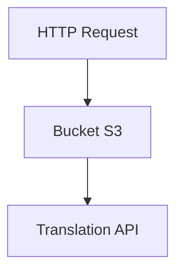
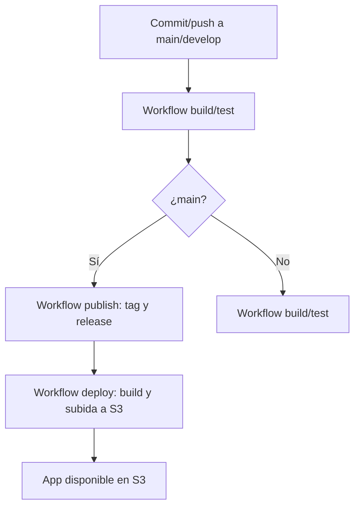

# tint-horror-app

[EN](README.md) | [ES](README_es.md)

[](https://github.com/antoniollv/tint-horror-app/actions/workflows/build.yml)


Aplicación web React que muestra tiras de cómics.

Pruebas de concepto de procesos CI/CD

## Tabla de Contenidos

- [Descripción](#descripción)
- [Estructura](#estructura)
- [Características](#características-de-la-aplicación)
- [Estructura del Proyecto](#estructura-del-proyecto)
- [Esquema](#esquema-de-la-aplicación)
- [Flujo CI/CD](#flujo-cicd)
- [Requisitos locales](#requisitos-locales)
- [Instalación en local](#instalación-en-local)
- [Despliegue](#despliegue)
  - [Infraestructura](#infraestructura)
- [Variables de Entorno](#variables-de-entorno)
- [Roles y policies AWS](#roles-y-policies-aws)
- [Secretos de GitHub](#secretos-de-github)
  - [Configuración](#configuración)
  - [Convenciones de commit (Conventional Commits)](#convenciones-de-commit-conventional-commits)
- [Estado actual del proyecto](#estado-actual-del-proyecto)
  - [Lo que está funcionando](#lo-que-está-funcionando)
  - [Pendientes o a revisar](#pendientes-o-a-revisar)
- [Licencia](#licencia)
- [Contribuciones](#contribuciones)

## Descripción

La aplicación carga un fichero de configuración _YAML_ y muestra imágenes como viñetas con sus bocadillos de texto. De estar disponible un API de traducción el texto es traducido según el idioma que indique el navegador

El objetivo es disponer de una aplicación _divertida_ para realizar pruebas de concepto de procesos CI/CD completos

La versión v1 despliega la aplicación en un bucket S3 de AWS, la descripción del proceso se describe en el documento [README_devops](./README_es.md)

## Estructura

- App React: [tint-strips/](tint-strips)
- Infraestructura como código: [infra/](infra)
- Workflows CI/CD:
  - [00-prerequisites.yml](.github/workflows/00-prerequisites.yml)
  - [01-infra-deploy.yml](.github/workflows/01-infra-deploy.yml)
  - [02-app-deploy.yml](.github/workflows/02-app-deploy.yml)
  - [publish.yml](.github/workflows/publish.yml)
  - [build.yml](.github/workflows/build.yml)
- Configuración del versionado automático: [.releaserc.json](.releaserc.json)
- Changelog: [CHANGELOG.md](CHANGELOG.md)
- Licencias: [LICENSE](LICENSE), [LICENSE-IMAGES](LICENSE-IMAGES)
- Documentación del desarrollo CI/CD: [README_devops.md](README_devops_es.md)
- Script para cargar el contenido de un directorio en AWS S3 Bucket : [upload_to_s3.sh](upload_to_s3.sh)

## Características de la aplicación

- Visualización de tiras cómicas con navegación interactiva.
- Selección de capítulos y paneles animados.
- Soporte multilenguaje mediante API de traducción
- Carga dinámica de recursos y optimización para distintos dispositivos.

## Estructura del Proyecto

```text
tint-horror-app/
├── infra/                # Infraestructura como código (Terraform, policies AWS)
├── tint-strips/          # Código fuente de la aplicación web
│   ├── src/              # Componentes React, hooks, utilidades
│   ├── public/           # Recursos públicos (imágenes, manifiestos)
│   └── build/            # Salida de la build de producción
└── .github/workflows/    # Workflows de CI/CD (GitHub Actions)
```

## Esquema de la aplicación



## Flujo CI/CD

El flujo de integración y despliegue continuo está automatizado con GitHub Actions y AWS S3. El proceso es el siguiente:



## Requisitos locales

- Node.js 22+
- npm 9+

## Instalación en local

1. Clona el repositorio

   ```bash
   git clone https://github.com/tuusuario/tint-horror-app.git
   ```

2. Instala dependencias

   ```bash
   cd tint-strips
   npm install
   ```

## Despliegue

El despliegue se realiza mediante GitHub Actions y AWS S3. Existen entornos `dev` y `prod`.

### Infraestructura

La infraestructura se gestiona con Terraform (buckets S3, policies IAM, roles OIDC, parámetros SSM).

1. Configura los secretos de AWS en GitHub (ver sección [Secretos de GitHub](#secretos-de-github)).
2. Ejecuta el workflow de pre-requisitos para crear los recursos base.
3. Ejecuta el workflow de despliegue para subir la app a S3.

> NOTA.- Es necesario contar con un TAG de release, se crean automáticamente al llevar a la rama `main` cambios con al menos un commit que cumpla _Conventional Commits_

## Variables de Entorno

Las variables de entorno se definen en archivos `.env.entorno` en `tint-strips/` y como secretos en GitHub:

```env
VITE_IMAGE_PATH=/imgs/
VITE_YAML_CONFIG_PATH=/comics.yml
VITE_TRANSLATION_API_URL=http://localhost:5000/translate
#VITE_TRANSLATION_API_KEY="SET IN GITHUB SECRETS"
```

Variables críticas como claves de AWS y API deben configurarse como secretos en GitHub (Settings > Environments).

## Roles y policies AWS

Se utilizan roles y policies para permitir a los workflows de GitHub Actions operar sobre los recursos de AWS:

- **Rol OIDC**: Permite a GitHub Actions asumir un rol en AWS mediante OIDC, limitado al repo y entorno configurado.
- **Policy IAM**: Permite crear, modificar y eliminar buckets S3, gestionar parámetros en SSM y operar sobre el backend de Terraform.

Los templates de policies se encuentran en

- [infra/policies/iam-policy.json.tpl](infra/policies/iam-policy.json.tpl)
- [infra/policies/trust-policy.json.tpl](infra/policies/trust-policy.json.tpl)

Variables y recursos se parametrizan por entorno (`dev`/`prod`).

## Secretos de GitHub

 solo para bootstrap, workflow de pre-requisitos

- `AWS_ACCESS_KEY_ID`
- `AWS_SECRET_ACCESS_KEY`

Los secretos requeridos en los entornos de GitHub son:

- `TRANSLATION_API_KEY`: Si se usa API de traducción y está lo requiere
- `AWS_REGION`: Region de AWS donde se desplegarán la infraestructura, aplicación y recursos. No es una información crítica pero mejor siempre limitar la información que se ofrece

Los secretos se definen en el entorno correspondiente (`dev` o `prod`) en GitHub > Settings > Environments.

### Configuración

- Configuración de `semantic-release`: [.releaserc.json](.releaserc.json)
- Configuración del entorno : [infra/prerequsites.json](infra/prerequsites.json)
  La configuración se guarda como parámetros en AWS Service Manager durante la ejecución del workflow de pre-requisitos

  - app_bucket_name": Nombre de la bucket S3 para la aplicación  
  - iam_role_name": AWS role para OIDC
  - iam_policy_name": IAM policy que se asignara al rol
  - tf_state_bucket": Bucket S3 para  permanencia del archivo tfstate de Terraform. Se aprovecha para depositar las imágenes de las viñetas
  - tf_state_key": Ruta y archivo tfstate de Terraform en el BUcket S3 de Terraform
  - images_folder": Ruta a las imágenes en el Bucket S3 de Terraform

### Convenciones de commit (Conventional Commits)

El tipo de commit determina la versión que se publica:

- `feat:` → **minor**
- `fix:` → **patch**
- `perf:` → **patch**
- `refactor:` → **patch** (si cambia comportamiento)
- `docs:`, `chore:`, `test:`, `build:`, `ci:` → **sin release**

Para **major**, añade `BREAKING CHANGE:` en el body del commit.

Ejemplos válidos:

- `feat: añadir selector de capítulos`
- `fix: corregir carga de comics.yml`
- `refactor: simplificar carga de tiras`

> Nota.- Para un commit con cambio incompatible, escribe `BREAKING CHANGE:` en el cuerpo.

---

## Estado actual del proyecto

Resumen breve del estado del código y los puntos a revisar.

### Lo que está funcionando

- App React funcional con navegación de viñetas.
- Bocadillos dinámicos y traducción automática.
- Carga de configuración desde YAML.
- Publicación en AWS S3

### Pendientes o a revisar

- Despliegue mediante contenedores
- El API de traducción debe estar disponible externamente.
- Solo está definidos el test de construcción `Test Build`

---

## Licencia

Este proyecto se publica como open source bajo:

- Código: MIT. Ver [LICENSE](LICENSE).
- Imágenes: Creative Commons Attribution 4.0 (CC BY 4.0). Ver [LICENSE-IMAGES](LICENSE-IMAGES).

---

## Contribuciones

¡Se aceptan contribuciones!

Si quieres mejorar este proyecto, corregir errores o proponer nuevas funcionalidades, puedes abrir un issue o enviar un pull request.

Por favor, sigue estos pasos:

1. Haz un fork del repositorio.
2. Crea una rama nueva para tus cambios.
3. Realiza tus cambios y haz commit.
4. Abre un pull request describiendo tu contribución.
